# homelab

Ansible repository for Proxmox and Kubernetes bootstrapping for DeskPi rack and OpenWrt Router.

<table>
<tr>
<td width="50%">

## 🚀 Rack Bootstrapping
```bash 
cd /home/rich/homelab
# Simple attempt at full
# rebuild (2/3 working attempts.)


# 1. Bootstrap (first time only)
make bootstrap
# 2. Setup Pis
make setup-pis
# 3. Setup Proxmox
make setup-proxmox
# 4. Create Proxmox Cluster
make setup-proxmox-cluster
# 5. Setup Kubernetes VMs
make setup-k8s
# 6. Deploy Kubernetes
make deploy-k8s
# 7. Setup Portainer
make setup-portainer
# 8. Check status
make status
```

</td>
<td width="50%">

## 🏠 Rack Build


</td>
</tr>
</table>

## network

```mermaid
graph TD
  %% Nodes
  RMT["💻 Remote Admin"]
  INTERNET["🌍 Internet"]
  PLUSNET["📡 Plusnet Modem (Bridge)"]
  OPENWRT["🧭 OpenWrt Router"]
  SWITCH["🔀 Switch"]
  VLAN10["📶 VLAN10 Home 192.168.10.0/24"]
  VLAN20["🧪 VLAN20 Homelab 10.20.0.0/24"]
  PIA["🔐 'Pi-A Bastion / WireGuard"]
  PIB["🧠 Pi-B Pihole DNS (10.20.0.3)"]
  MINI1["🖥️ M720Q-1 (Proxmox)"]
  MINI2["🖥️ M720Q-2(Proxmox)"]
  MINI3["💾 M720Q-3 (Proxmox)"]
  WIFI["📲 Wi-Fi Clients "]

  %% Connections
  RMT -->|🔒 WireGuard VPN| PIA
  RMT --> INTERNET
  INTERNET --> PLUSNET
  PLUSNET --> OPENWRT
  OPENWRT --> SWITCH
  SWITCH --> VLAN10
  SWITCH --> VLAN20

  VLAN10 --> WIFI
  VLAN20 --> PIA
  VLAN20 --> PIB
  VLAN20 --> MINI1
  VLAN20 --> MINI2
  VLAN20 --> MINI3

  %% Logical flows / labels
  PIA -->|🪜 SSH jump host| MINI1
  PIA --> MINI2
  PIA --> MINI3
  MINI1 -. DNS .-> PIB
  MINI2 -. DNS .-> PIB
  MINI3 -. DNS .-> PIB
  WIFI -. Optional DNS .-> PIB


```


