# homelab

a composible homelab in ansible, with some manual steps for learning and a sandbox for other things..

# 🚀 quick start

```bash
cd /home/rich/homelab

# 1. Bootstrap (first time only)
make bootstrap

# 2. Setup Pis
make setup-pis

# 3. Setup Proxmox
make setup-proxmox

# 4. Create Proxmox Cluster
make setup-proxmox-cluster

# 5. Setup Kubernetes VMs
make setup-k8s

# 6. Deploy Kubernetes
make deploy-k8s

# 7. Setup Portainer
make setup-portainer

# 8. Check status
make status
```


## 🔧 Common Tasks

### WireGuard Status

```bash
ssh ansible@10.20.0.2
sudo wg show
sudo ufw status
sudo systemctl status wg-quick@wg0
```

## 🔑 Default Ports

| Service | Port | Protocol |
|---------|------|----------|
| SSH | 22 | TCP |
| DNS | 53 | TCP/UDP |
| HTTP | 80 | TCP |
| HTTPS | 443 | TCP |
| WireGuard | 51820 | UDP |
| Proxmox Web | 8006 | TCP |

``` ansible -i inventory/hosts.yml all -m ping -vvv ```


## network

```mermaid
graph TD
  %% Nodes
  RMT["💻 Remote Admin"]
  INTERNET["🌍 Internet"]
  PLUSNET["📡 Plusnet Modem (Bridge)"]
  OPENWRT["🧭 OpenWrt Router"]
  SWITCH["🔀 Switch"]
  VLAN10["📶 VLAN10 Home 192.168.10.0/24"]
  VLAN20["🧪 VLAN20 Homelab 10.20.0.0/24"]
  PIA["🔐 'Pi-A Bastion / WireGuard"]
  PIB["🧠 Pi-B Pihole DNS (10.20.0.3)"]
  MINI1["🖥️ M720Q-1 (Proxmox)"]
  MINI2["🖥️ M720Q-2(Proxmox)"]
  MINI3["💾 M720Q-3 (Proxmox)"]
  WIFI["📲 Wi-Fi Clients "]

  %% Connections
  RMT -->|🔒 WireGuard VPN| PIA
  RMT --> INTERNET
  INTERNET --> PLUSNET
  PLUSNET --> OPENWRT
  OPENWRT --> SWITCH
  SWITCH --> VLAN10
  SWITCH --> VLAN20

  VLAN10 --> WIFI
  VLAN20 --> PIA
  VLAN20 --> PIB
  VLAN20 --> MINI1
  VLAN20 --> MINI2
  VLAN20 --> MINI3

  %% Logical flows / labels
  PIA -->|🪜 SSH jump host| MINI1
  PIA --> MINI2
  PIA --> MINI3
  MINI1 -. DNS .-> PIB
  MINI2 -. DNS .-> PIB
  MINI3 -. DNS .-> PIB
  WIFI -. Optional DNS .-> PIB


```



#### Pi-A (Bastion)
- **Role**: `pi-bastion`
- **Services**: WireGuard VPN, SSH jump host
- **Port**: 51820/UDP (WireGuard)
- **Access**: Primary entry point for remote administration

#### Pi-B (DNS)
- **Role**: `pi-hole`
- **Services**: Pi-hole DNS/DHCP, Ad-blocking
- **Port**: 53/TCP/UDP (DNS), 80/TCP (Web UI)
- **Access**: http://10.20.0.3/admin
